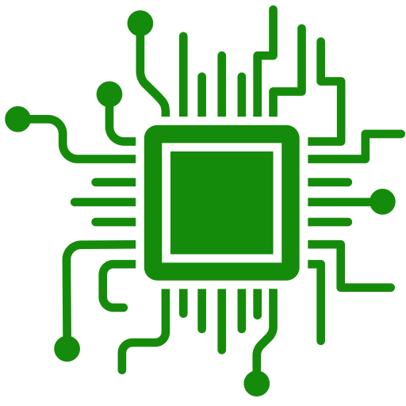
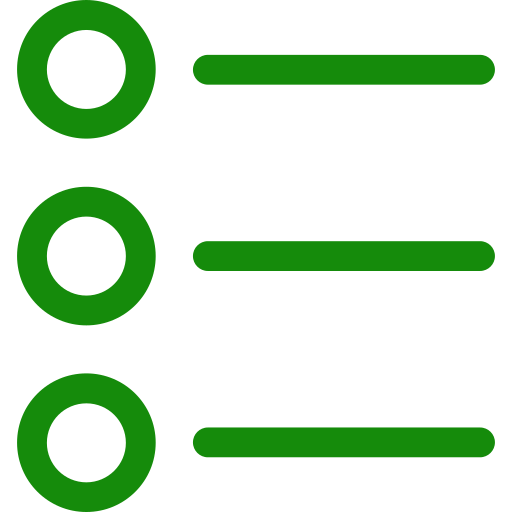
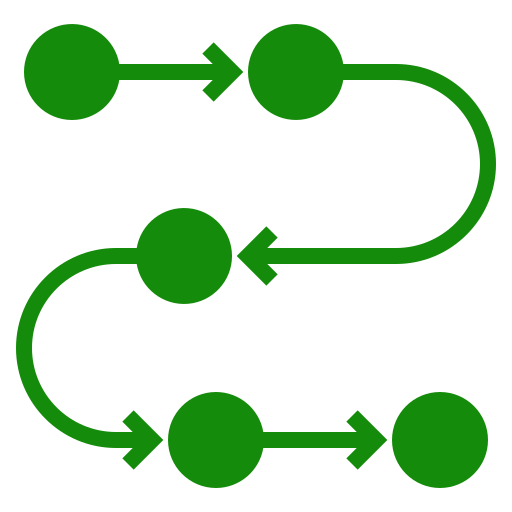
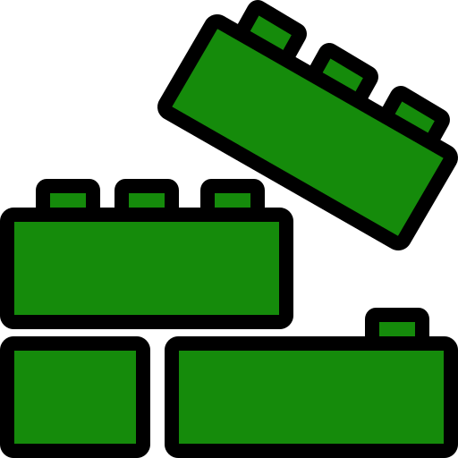
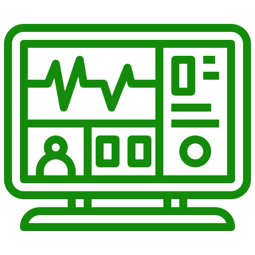

<h1></h1>
<ul>
  <h2>  Table of contents:</h2>
  <ul>
    <li><a href="https://github.com/AntiHexCode/PIC-8259A/tree/main?tab=readme-ov-file#-overview">Overview</a></li>
    <li><a href="https://github.com/AntiHexCode/PIC-8259A/tree/main?tab=readme-ov-file#-sequence-of-operation">Sequence of operation</a></li>
    <li><a href="https://github.com/AntiHexCode/PIC-8259A/tree/main?tab=readme-ov-file#-block-diagrams">Block diagrams</a></li>
    <li><a href="https://github.com/AntiHexCode/PIC-8259A/tree/main?tab=readme-ov-file#-signals">Signals</a></li>
    <li><a href="https://github.com/AntiHexCode/PIC-8259A/tree/main?tab=readme-ov-file#-simulation">Simulation</a></li>
    <li><a href="https://github.com/AntiHexCode/PIC-8259A/tree/main?tab=readme-ov-file#-testbench-methodolgy">Testbench methodolgy</a></li>
    <li><a href="https://github.com/AntiHexCode/PIC-8259A/tree/main?tab=readme-ov-file#-modifications">Modifications</a></li>
    <li><a href="https://github.com/AntiHexCode/PIC-8259A/tree/main?tab=readme-ov-file#-team-members">Team members and contribution</a></li>
  </ul>
  

  
<h2> Overview</h2>

    <ul>
    

      This project simulates 8259A PIC behavior using verilog, PIC is short for 
      <strong>P</strong>rogrammable <strong>I</strong>nterrupt <strong>C</strong>ontroller. The design
      was inspired from the <a href="https://drive.google.com/file/d/1ff_bdktK6zrH54DNJ6saOl5jdVz1-0MY/view?usp=drive_link">Intel datasheet</a> with some modifications.

      

      <storng>The design was divided into 4 major blocks as follows:</storng>
      <ul>
        <li>Read Write logic block</li>
        <li>Control logic block</li>
        <li>Interrupt logic block</li>
        <li>Cascade logic block</li>
      </ul>
    

    

      <strong>Our lovely PIC 8259A is designed to be:</strong>
      <ul>
        <li>8086 compatible</li>
        <li>Programmable</li>
        <li>Single +5V supply, no master clock</li>
        <li>Eight-Level Priority Controller</li>
        <li>Expandable to 64 Levels via cascading</li>
        <li>Handling interrupts in fully-nested mode</li>
        <li>Interrupt masking compatible</li>
        <li>AEOI supportive</li>
        <li>supportive for reading status</li>
      </ul>
    

    </ul>
  

  

    
<h2> Sequence of operation</h2>

    <ol>
        <li>All command words are sent from 8086 to the RW logic.</li>
        <li>RW logic parses the command words sending flags to control logic</li>
        <li>Whilst command words are being sent, all blocks are initializing according to the command words</li>
        <li>Once all command words are sent, other blocks can start working on the interrupt.</li>
        <li>Control logic triggers 8086 for interrupts</li>
        <li>Interrupt starts upon recieving the first INTA(active low) pulse, fetching the IRs</li>
        <li>Priority resolver chooses which request will be served taking into consideration various modes(fully-nested,rotation mode etc...)</li>
        <li>
          Control logic puts the vector address(from ISR) on the data bus upon recieving the second INTA pulse only if
          addressWrite flag is high (in single mode), in case of cascade mode, depending on current interrupt location,
          it would be put on the data bus by one of the slaves.
        </li>
        <li>8086 sends read signal, allowing to read ISR(current interrupt request in service), IRR and IMR</li>
    </ol>
  

  

    
<h2> Block diagrams</h2>

    <ul>
      
Control logic block diagram, the mastermind of the PIC, takes flags from R/W logic, parses the data to give it to other blocks

      
Read write logic block diagram, this block deals with 8086 directly, recieving command words, writing them and sending flags to the control logic 
      to make all blocks initialize their states and work correctly

      
To serve an interrupt, you have to notice it first. Handling multiple interrupts at the same time determining which has the highest priority, that is part of the Interrupt Logic Module's job

      
Instead of just 8 devices connected to the PIC, we can extend that up to 64 devices using the Cascade Logic Module

    </ul>
  

  

    
<h2> Signals</h2>

    <ul>
      <h3>Control Logic Signals (click on picture for better view)</h3>
       
      <h3>R/W Logic Signals (click on picture for better view)</h3>
       
      <h3>Cascade Logic Signals (click on picture for better view)</h3>
       
      <h3>Cascade Logic Signals (click on picture for better view)</h3>
       
    
  

  

    
<h2> Simulation</h2>

    <h3>PIC8259A Simulation</h3>
    <table>
      <tr>
        <th></th>
        <th></th>
      </tr>
      <ul>
        
        
        
      </ul>
    </table>
    <h3>R/W Logic Simualtion</h3>
    <table>
      <tr>
        <th></th>
        <th></th>
      </tr>
      <tr>
        <td> All command words written</td>
        <td>ICW3 and ICW4 aren't written</td>
      </tr>
      <tr>
        <td>ICW3 isn't written</td>
        <td>ICW4 isn't written</td>
      </tr>
    </table>
    <h3>Control Logic simulation</h3>
    <table>
      <tr>
        <th></th>
        <th></th>
      </tr>
      <tr>
        <td></td>
        <td></td>
      </tr>
      <tr>
        <td></td>
        <td></td>
      </tr>
      <tr>
        <td></td>
        <td></td>
      </tr>
    </table>
    <h3>Interrupt Logic Simulation</h3>
    <table>
      <tr>
        <th></th>
        <th></th>
      </tr>
      <ul>
        <td></td>
      </ul>
    </table>
    <h3>Cascade Logic Simulation</h3>
    <table>
      <tr>
        <th></th>
        <th></th>
      </tr>
      <ul>
        <td></td>
      </ul>
    </table>
  

  

    
<h2> Modifications</h2>

    <ul>
      <li>R/W logic works with an internal clock, since the command words need some form of sequence to operate, a clock was needed to enhance and ease the design of the logic of command words</li>
      <li>All blocks won't start working unless all command words are sent</li>
      <li>8086 must send all OCWs to facilitate the design of the blocks</li>
      <li>RW logic takes some of the control logic tasks such as parsing the data for command words and sends them to contorl logic</li>
      <li>Control logic and R/W logic can be reduced to one single complex block</li>
      <li>Interrupt logic block recieves the acknowledgement (INTA) directly from 8086</li>
      <li>Control logic sets the 8 bit vector address on the data bus not the ISR</li>
      <li>Control logic is responsible for reading the status of PIC, in exchange of R/W logic parsing the data and setting flags.</li>
    </ul>
  

  

    
<h2> Team members</h2>

    <ul>
    <table>
      <tr>
        <th>Name</th>
        <th>ID</th>
        <th>GitHub username</th>
        <th>Contribution</th>
      </tr>
      <tr>
        <td>Abdullah Mohammed</td>
        <td>2001803</td>
        <td><a href="https://github.com/AntiHexCode">AntiHexCode</a></td>
        <td>Control Logic, Read Logic, PIC8259A, Cascade Logic, Interrupt Logic</td>
      </tr>
      <tr>
        <td>Ahmad Mahfouz</td>
        <td>2002238</td>
        <td><a href="https://github.com/rye141200">rye141200</a></td>
        <td>Write Logic,Control logic, PIC8259A, Report</td>
      </tr>
      <tr>
        <td>Mohammed Mostafa</td>
        <td>2001299</td>
        <td><a href="https://github.com/mohamed-most">mohamed-most</a></td>
        <td>Interrupt Logic, Report</td>
      </tr>
    </table>
    </ul>
  

</ul>
Note that: The ICONS used in this README are from: <a href="https://www.flaticon.com">Flaticon</a>
